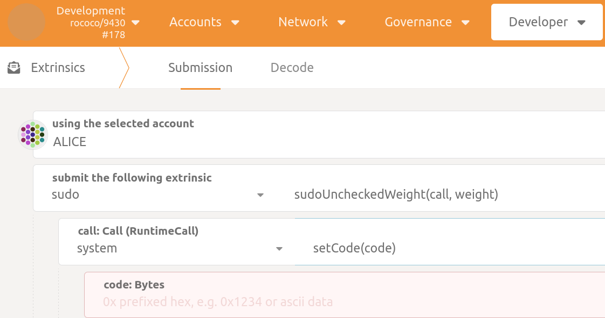

<!-- markdownlint-disable-next-line -->

# Polkadot Hosts: Conformance Testing

## Abstract

This report presents a comprehensive study on the conformance testing of Polkadot host node implementations. It delves into the importance of ensuring consistent behavior across all host implementations, the challenges involved, and the potential solutions. The report also reviews previous efforts in this domain, providing insights into their strengths and shortcomings. Furthermore, it discusses the testing of various aspects of the Polkadot protocol, including the host API, storage, and cryptographic functionalities. The report concludes with recommendations for future testing efforts, emphasizing the need for rigorous testing and strict adherence to the Polkadot specification document.

TODO: add a table of contents. Use pandoc to export to pdf and/or latex.

## Introduction

Polkadot, a flagship protocol of the Web3 Foundation, serves as an ecosystem for facilitating an interconnected, interoperable, and secure Web3 environment[@PolkadotDocs]. It is a complex software system, with its formal implementation built on top of a tech stack. The Polkadot ecosystem comprises various implementations of the Polkadot protocol, each contributing to the overarching goal of decentralization.

Each Polkadot network operates as a peer-to-peer (P2P) network, composed of host nodes. The behavior of these nodes is dictated by the current runtime. The runtime, stored in the blockchain, is unique for each network and defines the state transition function, which is the logic that dictates how the state of the blockchain changes over time[@PolkadotSpec].

A Polkadot node is a combination of a host implementation and a runtime. The host is the software that runs a blockchain node, responsible for networking, consensus, and the lower-level aspects of the blockchain.

In this report, our focus is on testing the host implementations of the Polkadot protocol, not runtimes. Ensuring consistent behavior across all host implementations is a non-trivial task, given the complexity and the different programming languages involved.

The stability of a network is enhanced when there are multiple implementations of the host node. However, to ensure the integrity of the network, it is crucial that all host implementations comply with the specification document. We will document various existing approaches to this challenge, provide commentary on the approaches we have tested, and share our findings and recommendations. We will also consider different aspects, such as the additional workload for the node developer and the maintenance cost of such testing.

At the time of this writing, there exist three primary implementations of the Polkadot protocol:

- Parity Polkadot, implemented in Rust ([Source Code](https://github.com/paritytech/polkadot-sdk))
- Kagome, implemented in C++ ([Source Code](https://github.com/qdrvm/kagome))
- Gossamer, implemented in Go ([Source Code](https://github.com/ChainSafe/gossamer))

The Polkadot Mainnet predominantly uses Parity's implementation. The introduction of a new host node implementation that does not strictly adhere to the specifications of the Polkadot protocol could potentially lead to undesired behavior. This non-compliance could introduce inconsistencies in the network's operation, leading to instability or even a complete network failure, rendering Polkadot unavailable.

It's important to note that the risk isn't limited to new, non-compliant implementations. Even a compliant node could be forked and modified to introduce errors or malicious behavior, posing a threat to the network's integrity. Therefore, rigorous testing and conformance to the specification document are crucial for all host node implementations, whether they are new or derived from existing, compliant nodes.

## Previous Related Work

In this section, we delve into the previous efforts made towards testing Polkadot host node implementations. These initiatives, undertaken by various teams and individuals, have laid the groundwork for our current understanding of the challenges and potential solutions in this domain. By examining these past endeavors, we can better appreciate the complexities involved, learn from their successes and shortcomings, and build upon their findings to enhance the robustness and reliability of Polkadot host node implementations.

### W3F Polkadot tests

The Polkadot conformance testsuite ([Source Code](https://github.com/w3f/polkadot-tests)) was initiated in 2020 to test the SCALE encoding, state trie hashing, host API, and genesis import on the three Polkadot implementations.

Implemented in the Julia language, the testsuite leveraged the Foreign Function Interface (FFI) to interact with functions and data types from the three Polkadot implementations. Julia was chosen for its ability to easily interface with libraries from other languages, a crucial feature for testing implementations written in different programming languages.

Despite its comprehensive nature, the project was archived in September 2023 and is no longer maintained. The reasons for this are not publicly documented, but it's possible that the maintenance overhead, coupled with the complexity of keeping up with the evolving Polkadot specification, contributed to this decision.

#### Strengths

The W3F Polkadot testsuite offers several advantages. One of the most significant is that it doesn't require any code modifications from the node maintainers in order to test the different host implementations. This makes it a highly accessible tool, ready to use out of the box.

Moreover, the testsuite is implemented in Julia, a high-level, high-performance dynamic language for technical computing. Julia's ability to easily interface with libraries from other languages makes it an ideal choice for testing implementations written in different programming languages. This feature is particularly beneficial for a project like Polkadot, which has implementations in multiple languages.

The testsuite is also comprehensive, covering various aspects of the Polkadot protocol. This includes testing the SCALE encoding, state trie hashing, host API, and genesis import on the three Polkadot implementations.

Despite being archived and no longer maintained, the W3F Polkadot testsuite serves as a valuable reference for understanding the complexities involved in testing Polkadot implementations. It provides insights into the approaches that can be used to tackle these complexities, and the lessons learned from this project can inform and guide future testing efforts.

#### Challenges

The W3F Polkadot testsuite, while comprehensive, faced several challenges. One of the primary challenges was the reliance on the Foreign Function Interface (FFI) for three different languages: Go, Rust, and C++. This required a deep understanding of the different codebases, which proved to be demanding and time-consuming for the testsuite maintainer. With every new release, the testsuite needed to be checked and updated to ensure compatibility and accuracy.

Another challenge was the nature of the tests for the SCALE encoding, State Trie, and the host-API. These tests were not designed to test the actual implementation code of the node, but instead, they tested the code written for the library. This approach, while useful for validating the library code, did not provide a comprehensive evaluation of the underlying implementation code in the node.

Furthermore, some of the tests were designed to simply check for the absence of error messages, rather than verifying a specific expected output. While this approach can help identify glaring issues, it may not be sufficient to detect subtle inconsistencies or deviations from the expected behavior. A more robust testing approach would involve checking for specific expected outputs to ensure the accuracy and consistency of the implementation.

Despite these challenges, the W3F Polkadot testsuite has been a valuable resource for understanding the complexities involved in testing Polkadot implementations. The lessons learned from this project can inform and guide future testing efforts, potentially leading to more robust and comprehensive testing strategies.

### Polkafuzz

The Polkafuzz ([Source Code](https://github.com/sigp/polkafuzz)) is a fuzzing testsuite specifically designed for Polkadot and its related implementations, including Smoldot and Gossamer. The project is hosted on GitHub and is maintained by Sigma Prime (sigp).

Fuzzing is a dynamic code testing technique that involves providing invalid, unexpected, or random data as inputs to a computer program. The program is then monitored for exceptions such as crashes, failing built-in code assertions, or potential memory leaks.

Polkafuzz is written in Rust and leverages popular fuzzing libraries like honggfuzz and cargo-fuzz. It focuses on testing specific functionalities of the Polkadot implementations, such as SCALE encoding, state trie hashing, and host API functions. By providing random inputs to these functionalities and observing the output, Polkafuzz can help identify potential bugs, crashes, or unexpected behaviors in the code.

#### Strengths

Polkafuzz's strength lies in its ability to uncover potential issues that might not be detected by traditional testing methods. It can identify crashes, memory leaks, and unexpected behaviors in the code, making it a valuable addition to unit tests. Furthermore, it does not require any additional functionality from the node to work, making it easy to integrate into existing testing workflows.

#### Challenges

Despite its strengths, Polkafuzz also faces some challenges. One of the primary challenges is its reliance on the Foreign Function Interface (FFI) for the Gossamer implementation. Maintaining FFI across different languages and implementations can be a complex and time-consuming task.

Additionally, fuzzing tests in Polkafuzz are typically run on small, isolated functions in the code. While this approach is useful for identifying issues in specific functionalities, it does not provide a comprehensive evaluation of the overall behavior of a running node. Therefore, while Polkafuzz is a valuable tool for enhancing unit tests, it should be used in conjunction with other testing methods to ensure a comprehensive evaluation of the Polkadot implementations.

### Zombienet

Zombienet ([Source Code](https://github.com/paritytech/zombienet))is a command-line tool designed to spawn and test ephemeral Polkadot/Substrate networks. It is currently under active development and is already being utilized by several projects within the Polkadot ecosystem.

#### Strengths

Zombienet's primary strength lies in its ability to create temporary networks of nodes and perform tests against them. This feature allows for the simulation of various network conditions and behaviors, providing a comprehensive testing environment for Polkadot implementations. The tool supports assertions on on-chain storage, metrics, logs, and even custom JavaScript scripts that interact with the chain. To facilitate the writing of tests, Zombienet incorporates a natural language interface, making the process as smooth as possible. It is designed to run on Node.js and supports different backend providers to run the nodes, including Kubernetes, Podman, and native.

#### Challenges

Despite its strengths, Zombienet faces a few challenges. As it is still in the development phase, its documentation may be incomplete or outdated, and its API/config may undergo changes. This could potentially pose difficulties for users trying to understand or utilize the tool. Additionally, as a network-level testing tool, Zombienet may not be suitable for testing specific internal features of a node. It is also worth noting that the tool's effectiveness is dependent on the quality and coverage of the tests written by the users, which could vary significantly.

Another potential challenge is the use of a custom language, known as Zombienet, for defining tests. Zombienet is a domain-specific language (DSL) developed specifically for this tool. It is designed to simplify the process of writing tests by providing a high-level, declarative syntax for defining network configurations and test scenarios. However, as with any new language, it may introduce a learning curve for users unfamiliar with its syntax and semantics. This could potentially hinder the tool's accessibility and ease of use. Despite this, the developers of Zombienet have made efforts to make the language as intuitive and user-friendly as possible, providing comprehensive documentation and examples to help users get started.

#### Related work

Ethereum Hive [@EthereumHive] is a similar tool in the Ethereum ecosystem that allows for the creation of local Ethereum networks for testing purposes. It provides a Docker-based framework for running integration tests against Ethereum clients.

While both Zombienet and Ethereum Hive serve similar purposes in their respective ecosystems, there are some key differences. Ethereum Hive is more mature and has a broader user base, given Ethereum's longer existence. It also has a more extensive set of pre-defined tests, particularly for Ethereum's JSON-RPC interface.

On the other hand, Zombienet, being newer, is designed with the latest technologies and practices in mind. It supports a wider range of backend providers for running nodes and has a more user-friendly interface for writing tests. Furthermore, Zombienet is designed specifically for the Polkadot/Substrate ecosystems, making it more suitable for testing Polkadot implementations.

In conclusion, while both tools have their strengths and weaknesses, they both serve as valuable resources for testing blockchain implementations in their respective ecosystems.

## Discussion

Testing Polkadot host node implementations remains an open problem in the Polkadot ecosystem, despite previous efforts. The challenges encountered in these efforts can be summarized as follows:

1. Language and Interface Dependencies: Some projects relied heavily on specific languages or interfaces, which introduced complexities and maintenance challenges.

2. Limited Scope: Some testing approaches focused on specific aspects, such as the absence of error messages or testing small functions, which limited their effectiveness in providing a comprehensive evaluation of the overall behavior of a running node.

3. Maintenance Burden: Some approaches required significant modifications or additions to the node, which could add to the workload of node maintainers.

On the other hand, these efforts also had notable advantages:

1. No Node Modification: Some approaches, like P2P testing, did not require any modification to the node, making them easy to set up and run.

2. Implementation Agnostic: Some testing methods were implementation agnostic, allowing for collaboration across different implementations.

3. Specific Scenario Testing: Some methods allowed for testing specific scenarios, which could be beneficial for debugging and ensuring similar behavior across different implementations.

In terms of testing levels, these efforts can be classified into unit testing, integration testing, and system testing. Each level has its own strengths and weaknesses, and a comprehensive testing solution would ideally cover all levels. Unit tests are great for testing individual components, integration tests check the interaction between different components, and system tests evaluate the system as a whole. However, each level of testing also presents its own challenges, such as granularity, scope, and maintenance burden.

In conclusion, a future solution should aim to address these challenges while leveraging the advantages of previous efforts. It should be language and interface agnostic, provide a comprehensive evaluation of the node, require minimal modifications to the node, and cover all levels of testing.

In the subsequent subsections, we will explore various testing methodologies applied to Polkadot host node implementations. These include:

- Testing through RPC endpoints
- Testing the host API with a specific runtime
- Unit testing
- Integration tests using P2P messages

Each method offers unique insights and presents its own set of challenges, which we will discuss in detail to provide a comprehensive understanding of their implications for future testing efforts.

### Testing throught RPC endpoints

Our initial approach to testing Polkadot host node implementations extended the work done by the Web3 Foundation (W3F), which utilized the Foreign Function Interface (FFI) to test parts of the code using a Julia script. However, maintaining FFI for three different implementations in three different languages proved to be a significant challenge.

An alternative approach suggested was to create special RPC endpoints directly in the node code. This method was implemented on the Polkadot node in Rust([Source Code](https://github.com/Zondax/polkadot-sdk/blob/zondax/polkadot/zondax/src/lib.rs)), and involved writing Python [tests](https://github.com/Zondax/Polkadot-conformance-tests) for the SCALE encoding, the State Trie Hash. This endpoint is not enable by default but through a custom compilation flag.

Despite its success, this approach had limitations. The tests were not directly examining the implementation but were rewriting some code using the same library for this endpoint. This meant that the tests were not able to access more in-depth code due to multiple layers. Additionally, navigating a source code as extensive as the Polkadot SDK was time-consuming and challenging.

This method also placed additional responsibilities on the node maintainer. They would need to add and maintain these testing endpoints, which could increase their workload and potentially lead to frustration. In the following chapters, we will present a less burdensome approach that would actually help node maintainers to be confident in their node implementation.

### Testing host API with specific runtime

In the previous sections, we discussed the idea of using custom RPC endpoints for testing important features using a unit-test approach. This methodology was also considered for the evaluation of the host-api1.

However, we encountered challenges with this approach. The complexity of mapping runtime entry points to discrete host-api function calls proved to be nonviable. The mapping did not always maintain a one-to-one relationship; instead, it frequently required a one-to-many mapping schema. This complexity significantly diminished the feasibility of executing unit tests.

This issue became particularly evident when multiple calls to the host-api occurred as a result of a single invocation by the runtime during the processing of new blocks or extrinsics. This situation contradicted our goal of ensuring that the node's host-api implementation aligns with the specification's definitions for each method, arguments, and return types.

Given these challenges, we reconsidered our initial strategy. We concluded that employing a custom [RPC endpoint](https://github.com/Zondax/polkadot-sdk/blob/zondax/polkadot/zondax/src/lib.rs#L131-L144) remains a beneficial means to isolate the node's implementation from our testing framework. However, to effectively assess the host-api implementation independently—without triggering unrelated runtime method calls during the process—significant modifications were necessary.

Therefore, we decided to adapt the runtime by integrating [additional](https://github.com/Zondax/polkadot-sdk/blob/zondax/polkadot/runtime/polkadot/src/lib.rs#L1640-L1647) exported methods. These methods are designed to precisely redirect a call to its associated host-api method, thereby establishing a direct one-to-one correlation between the runtime and host-api. This enhancement simplifies the process of unit testing the host implementation by ensuring that each test is self-contained and interacts exclusively with the intended host-api functionality.

We later realized that developing these new exported methods in the runtime was not as difficult as initially thought. They are relatively simple, as they just consist of making a call to the host-api. Below is a short description of the RPC endpoint compatible with our test suite.

#### Host-api Proof of Concept

The host-api is a crucial component of the Polkadot ecosystem. It serves as the interface between the runtime and the host, allowing the runtime to access and manipulate the state of the host. This interaction is vital for the functioning of the Polkadot node, as it enables the runtime to perform operations such as storage manipulation and cryptographic operations.

To ensure compatibility with our test suite, which is designed to evaluate the node's host-api, we have developed an RPC endpoint as outlined below:

```rust
fn host_api(method: String, args: Vec<u8>) -> RpcResult<Vec<u8>>;
```

This Rust method provides a general framework that highlights the key components of the RPC infrastructure, which include:

- **host_api**: This is the name of the rpc method. It serves as the entry point for the runtime to interact with the host.

- **method**: This parameter specifies the name of the runtime method that is intended to be invoked. It identifies the target function within the runtime environment.

- **args**: These are the arguments for the runtime method, encoded using the SCALE. They provide the necessary data for the runtime method to perform its operation.

The modifications to the runtime were relatively straightforward. For this proof of concept, we developed six new runtime exported methods designed to test the following sections of the specification:

- **Storage**: We added tests to check storage operations such as: _set_, _get_, and _clear_.

- **Crypto**: We added tests to check some basic **SR25519** cryptography operations like _generating keys_, _signing_, and _verifying_ signatures.

```rust
impl self::ZondaxTest<Block> for Runtime {
        fn set_storage(key: Vec<u8>, value: Vec<u8>) {
            sp_io::storage::set(&key, &value);
        }

        fn get_storage(key: Vec<u8>) -> Option<Vec<u8>> {
            sp_io::storage::get(&key).map(|bytes| bytes.to_vec())
        }

        fn clear_storage(key: Vec<u8>){
            sp_io::storage::clear(&key)
        }
    }
```

The code snippet above, named storage_runtime, demonstrates the minimal extent of modifications required to integrate three new exported methods into Polkadot's runtime. These changes were implemented specifically for the purpose of testing the storage host-api. For more information on the host-api and its role in the Polkadot ecosystem, please refer to the @PolkadotDocs.

For instructions on how to run the test suite for host-api refer to the [appendix](#executing-rpc-tests) at the end of this document.

#### **Advantages of the Host_API RPC Endpoint**

- **Unified Interface:** The host_api RPC endpoint provides a single, unified interface for calling any host-api implementation. This enhances the efficiency of the testing process by providing a consistent interface across different implementations.

- **Targeted Testing:** This approach is advantageous for scenarios that require precise testing of specific host-api functions, such as storage and cryptographic operations. It allows for targeted testing of these specific functionalities.

- **Comprehensive Testing:** The host_api RPC endpoint enables comprehensive testing of a wide range of host-api functionalities. This ensures a thorough evaluation of the host-api implementation.

#### **Disadvantages of the Host_API RPC Endpoint**

- **Implementation Specific:** The design of the host_api RPC endpoint is closely tied to the Rust implementation. This creates uncertainties regarding its compatibility with other node implementations.

- **Runtime Modification:** The use of the host_api RPC endpoint requires changes to the runtime. While these changes are manageable due to our focus on the official Rust implementation, they limit the flexibility in runtime environments.

- **Maintenance Complexity:** The evolving nature of other node implementations leads to a higher maintenance burden for the test suite team. This necessitates ongoing adjustments to ensure the relevancy and effectiveness of the tests.

The approach of using an RPC endpoint for testing Host-api, despite its inherent challenges, offers substantial benefits. It provides a robust mechanism for verifying runtime functionality and ensuring strict adherence to the Polkadot specifications. This method enables comprehensive testing that is both targeted and scalable, which is crucial in the development and maintenance of a reliable and spec-compliant Polkadot Host-API.

While acknowledging its disadvantages, it's important to note that this approach represents a significant advancement towards achieving a robust and efficient WASM runtime environment. This is a critical component in the evolving landscape of Polkadot, where reliability and specification compliance are paramount.

### Specification Test Vectors

Tests, especially unit tests, are a crucial part of any robust testing strategy. While individual projects typically have their own tests for various components, our proposal aims to centralize these tests for specific modules such as SCALE encoding and State Trie hashing. Each implementation of these modules has developed their own tests, based on their interpretation of the specification in their respective programming languages.

By creating tests in a universal format like JSON or TOML, we can ensure that all implementations are testing the same functionalities and behaving as expected. This approach also encourages feedback from node maintainers, which can help identify potential implementation issues and improve the overall quality of the tests.

The idea behind this approach is that the specification document results in a set of test vectors and expectations. These test vectors serve as a common ground for all implementations, ensuring that they are all adhering to the same standards and behaviors as outlined in the specification document. However, a potential disadvantage of this approach is that different implementations may not have the same units and the test vectors may not be readily applicable. This could lead to discrepancies in the testing process, as the same test vector might produce different results in different implementations due to the variations in their units. Therefore, while this approach provides a unified testing framework, it also requires careful consideration and potential adjustments to accommodate the unique characteristics of each implementation.

It's important to emphasize that this approach may not be only applicable to unit tests. We consider that unit tests would immediately profit from running parameterized tests using these test vectors. However, other types of tests could also benefit from this approach, expanding its potential impact and utility in the testing process.

### P2P Message-Based Integration Testing

Integration testing is a common practice in software development, designed to evaluate the overall behavior of a program. In the context of Polkadot, we aim to ensure consistent behavior across nodes in various scenarios, preventing unpredictable interactions.

One approach to testing different scenarios involves mocking a node to perform specific actions. P2P messages can be used to send blocks, transactions, validate blocks, etc. We have developed a proof-of-concept [@p2ptests] in Javascript (due to the well-maintained libp2p in Javascript) that tests connections to a node, regardless of the node's language implementation.

This approach offers several advantages. It requires no modifications by the node maintainer and can be easily run without the need to operate multiple nodes. It also allows for the testing of specific and potential corner-case scenarios, aiding in debugging.

```javascript
async function main() {
    const peerId = await createEd25519PeerId()

    const node = await createLibp2p({
        transports: [tcp(), webSockets()],
        streamMuxers: [yamux(), mplex()],
        connectionEncryption: [noise()],
        addresses: {
            listen: ['/ip4/0.0.0.0/tcp/0']
        },
        services: {
            ping: pingService(),
        },
        peerId,
    })
    // start libp2p
    await node.start()

    const targetNode = multiaddr('/ip4/127.0.0.1/tcp/30333/p2p/12D3KooWKhoAeaMcMRXeY6oPvSJWH3YKg8m9Ad8xnGUey3N6zaSx')

    const conn = await node.dial(targetNode)

    // Start testing here
    ...
}
```

#### **Strengths**

- **Implementation-agnostic**: P2P testing is not tied to a specific language or implementation, making it versatile and adaptable. This is similar to the approach used by EthereumHive for testing Ethereum clients.

- **Quick and easy to set up**: P2P testing does not require complex setup procedures or extensive resources, making it a practical choice for regular testing routines. This is a feature also highlighted in the Zombienet documentation.

- **Scenario testing**: P2P testing allows for the creation of specific scenarios, including edge cases, to ensure that all implementations behave consistently under various conditions. It also allows for the manipulation of network conditions to trigger specific behaviors, adding to its versatility.

- **Facilitates collaboration across implementations**: By providing a common testing ground, P2P testing encourages collaboration and knowledge sharing across different implementation teams.

- **Requires no modifications to the node**: P2P testing can be conducted without any modifications to the node, ensuring the integrity of the code being tested.

#### **Challenges**

- **Not granular**: P2P testing does not provide detailed insights into the specific components or functions of an implementation. While it is effective for wide-ranging integration tests, it may not be suitable for pinpointing specific issues within an implementation.

- **Limited Coverage**: P2P testing primarily focuses on the interaction between nodes, which may not cover all aspects of an implementation's functionality.

- **Dependent on Network Conditions**: The effectiveness of P2P testing can be influenced by network conditions, which can introduce variability in the testing results. However, this can also be leveraged to test the robustness of implementations under different network conditions.

- **Requires a Running Node**: P2P testing requires a running node, which may not always be feasible or practical, especially in continuous integration environments. However, this also allows for testing in conditions that closely mimic real-world operation.

While this testing method can potentially miss some bugs when used alone, it serves as a valuable complement to unit testing. It's worth noting that this approach is similar to the one used by @EthereumHive for testing Ethereum clients. This further validates the effectiveness of P2P testing in ensuring consistent behavior across different node implementations.

## Conclusions

The Polkadot network primarily operates on the official Rust-based Polkadot ([Source Code](https://github.com/paritytech/polkadot-sdk)). However, alternative implementations, such as Kagome (C++) and Gossamer (Go), exist. These alternatives could potentially introduce variations in protocol adherence. Ensuring these diverse implementations integrate seamlessly into the mainnet is crucial, as deviations from the Polkadot protocol specifications could destabilize the network.

Our analysis has identified three key testing methodologies to ensure uniform behavior across all Polkadot node implementations:

1. **RPC Endpoint Testing**:

   - **Objective**: Evaluate SCALE encoding/decoding and host-APIs.

   - **Method**: This approach requires each node implementation team to add specific RPC handlers for testing. The effectiveness of this testing method depends on the active engagement of each Polkadot implementation's maintainers in both the development and maintenance of the necessary RPC endpoints for our testing suite. Their active participation is crucial to the success and effectiveness of the RPC Endpoint Testing approach.

   - **Advantage**: Leverages the teams' expertise in their own codebases and languages, provided they continue to collaborate in the process.

   - **Support**: Extensive documentation on RPC endpoint specifications is provided for ease of implementation. However, the success of this method hinges on the sustained and collaborative effort from all node implementation teams.

   - **Drawbacks**:

     - Testing host-APIs requires a custom wasm runtime for mapping to host-api functions, adding overhead and workload for the testing team to maintain this runtime.

     - The testing setup becomes more complex as it requires updating the wasm runtime used by default in nodes. This process can be automated but is intricate due to its dependence on the 'setCode' transaction.

     - Additional state setup is required in nodes for certain host-api functions.

     - The complexity increases on the Python script side for encoding/decoding intricate data types needed by host-api methods, given the current challenging state of support for scale encoding/decoding.

2. **Unit Testing with Test Vectors**:

   - **Objective**: Provide standardized test vectors for integration into unit testing frameworks.

   - **Advantage**: Facilitates consistent and reproducible testing across different implementations.

3. **P2P Message-Based Testing**:

   - **Objective**: Serves as a broader integration testing method.

   - **Advantage**: Requires no modifications to the node implementations, ensuring code integrity.

   - **Limitation**: While less granular, it's effective for wide-ranging integration tests.

We are currently developing a test suite as a proof of concept. This suite is expected to include a custom runtime featuring our specific testing functions, accompanied by Python scripts and JavaScript tests. The ultimate goal is for node implementers to integrate this suite into their continuous integration systems. This integration would provide a substantial layer of assurance that any modifications align with the Polkadot specifications. As the CI process validates changes, it will serve as a strong indicator of compliance with protocol standards.

This multi-faceted approach, combining the strengths of RPC, unit testing, and libp2p methods, alongside the emerging test suite, is poised to significantly enhance the robustness and reliability of the Polkadot network. Our proof of concept aims to evolve into a comprehensive solution, ensuring that discrepancies in node implementations do not disrupt the network's harmony and performance.

<!-- markdownlint-disable-next-line -->

# Supplementary Information

This section provides further details, resources, and references that supplement the primary content of this report, offering a deeper understanding of the discussed methodologies and their implications.

## Executing RPC Tests

This section provides a comprehensive guide for executing the tests that serve as a Proof of Concept (PoC) for testing the Polkadot host API.
At present, these instructions are specifically tailored for the official Rust implementation of Polkadot.

### Prerequisites

Prior to running the test suite, it is imperative to ensure that the host machine has the following packages installed:

- Python 3.10

- Docker 24.0.7

- Git

The installation instructions for these packages may vary based on your operating system and are readily available online. As such, detailed installation steps are beyond the scope of this document.

In addition to the above, the following Python package is required:

- [scalecodec](https://github.com/polkascan/py-scale-codec#installation)

### Configuring the Test Environment

To configure the test environment, the first step is to clone the **Polkadot-conformance-tests** [@pytests] repository and navigate to the cloned directory:

```bash
git clone https://github.com/Zondax/Polkadot-conformance-tests.git
cd Polkadot-conformance-tests
```

Subsequently, compile and initiate the Polkadot node using Docker Compose:

```bash
docker compose -f docker/zondax-compose.yml up --build
```

This process may take some time, depending on your system's performance. Upon completion, the node's logs will be displayed on the screen, indicating a successful startup. The setup also includes a service for interacting with the node through a web browser, which is essential for uploading the custom runtime compiled in the final step.

### Accessing the Node via Browser

After ensuring that the node is running, open the following URL in your browser:

```text
http://127.0.0.1/#/extrinsics
```

If you encounter a warning message stating that the node is not running, please allow some additional time for the node to finish setting up and initializing the RPC handlers.

### Uploading Custom Runtime

The Polkadot-js UI service should automatically connect to the local node. Once connected, navigate to the **Developer** menu and select the **Extrinsics** submenu. This action opens a form for creating transactions. To update the node with a new runtime, use the **setCode** transaction as shown in Figure [1](#fig:tx_menu){reference-type="ref" reference="fig:tx_menu"}:

{#fig:tx_menu width="50%"}

It is essential to enable the **sudo** attribute for the _ALICE_ account when updating the runtime; failing to do so will result in the operation being unsuccessful. The next step involves enabling the code upload functionality and selecting the appropriate runtime to be sent to the node.

The Docker Compose service provided in our setup takes care of compiling the custom runtime. This compiled runtime is automatically copied to the _docker/build_artifacts_ directory. From this directory, you need to select the file named _polkadot_runtime.compact.compressed.wasm_.

After selecting the runtime file, the Polkadot-js UI will display the runtime code in the interface. To finalize the process, navigate to the bottom right of the UI and click on **Submit transaction**. Upon confirming this action, a notification will appear, indicating the successful submission of the transaction. This update process is a critical step to ensure the node is running with the intended custom runtime, enabling the subsequent execution of RPC tests.

### Executing scale encoding test

This test aims to verify the node's ability to encode any data according to the SCALE specification. For this purpose, our python script will send data to be encoded by the node and assert that it is indeed correctly encoded following the specification.

To execute the RPC tests, run the following Python command:

```bash
python scripts/encoding.py
```

The output of this command should be similar to the following:

```text
> Sent: {"jsonrpc": "2.0", "method": "scale_encode", "params": {"test": {"U32": 42}}, "id": 1}
< Received: {"jsonrpc":"2.0","result":"2a000000","id":1}
> Sent: {"jsonrpc": "2.0", "method": "scale_encode", "params": {"test": {"Str": "Zondax"}}, "id": 1}
< Received: {"jsonrpc":"2.0","result":"185a6f6e646178","id":1}
> Sent: {"jsonrpc": "2.0", "method": "scale_encode", "params": {"test": {"I64": -1}}, "id": 1}
< Received: {"jsonrpc":"2.0","result":"ffffffff","id":1}
> Sent: {"jsonrpc": "2.0", "method": "scale_encode", "params": {"test": {"Vec": [4, 8, 15, 16, 23, 42]}}, "id": 1}
< Received: {"jsonrpc":"2.0","result":"1804080f10172a","id":1}
> Sent: {"jsonrpc": "2.0", "method": "scale_encode", "params": {"test": {"F64": 42.0}}, "id": 1}
< Received: {"jsonrpc":"2.0","result":"0000000000004540","id":1}
> Sent: {"jsonrpc": "2.0", "method": "scale_encode", "params": {"test": {"Tuple": [1, "Zondax"]}}, "id": 1}
< Received: {"jsonrpc":"2.0","result":"0100185a6f6e646178","id":1}
```

This output demonstrates the interactions between the script and our local node, showcasing the JSON-RPC messages sent and the corresponding valid-scale-encoded responses received.

### Testing HOST-API storage

To test the node's ability to perform storage set, get, and clear operations as per the specification, execute the following Python command:

```bash
python scripts/host_api/storage.py
```

This script engages with the node to evaluate storage-related functions. It executes a sequence of operations to store, fetch, and erase data in the node's storage. The anticipated output should solely consist of a report detailing the data transmitted and the responses obtained from the node, devoid of any error messages. This output confirms that the node accurately manages storage operations in line with the Polkadot specification.

### Testing HOST-API Crypto

This test is designed to evaluate the node's cryptographic functionalities, specifically focusing on the generate, sign, and verify operations using the **sr25519** curve.

```bash
python scripts/host_api/storage.py
```

The expected output of this command is a detailed report of the data sent to and received from the node. The absence of error messages in the output indicates that the cryptographic operations are functioning as expected.

## P2P Testing Proof-of-Concept

To execute the proof-of-concept P2P testing suite, clone the **polkadot-p2p-testings** project from its repository [@p2ptests].

```bash
git clone https://github.com/Zondax/polkadot-p2p-testings.git
cd  polkadot-p2p-testings
```

Next, start a development Polkadot node using Docker.

```bash
docker build -t polkadot -f Dockerfile.polkadot .
docker run -p 30333:30333 polkadot
```

Once the node has started, open a new terminal and initiate the test to connect to this node.

```bash
npm install
DEBUG=* npm start
```

The **DEBUG=\*** flag is useful for gaining insights into the underlying operations of libp2p.
